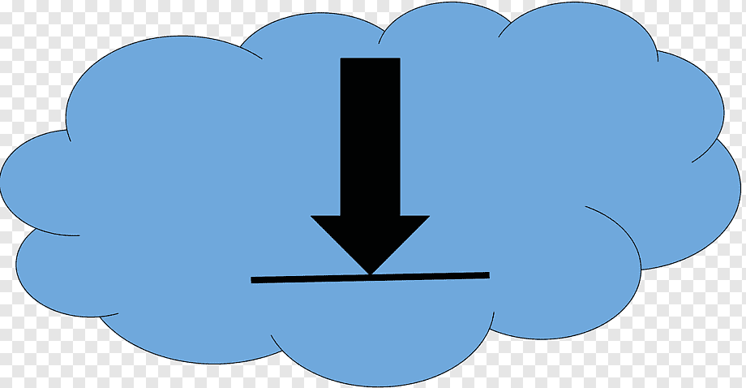

[![Contributors][contributors-shield]][contributors-url]
[![Forks][forks-shield]][forks-url]
[![Stargazers][stars-shield]][stars-url]
[![Issues][issues-shield]][issues-url]
[![MIT License][license-shield]][license-url]
[![LinkedIn][linkedin-shield]][linkedin-url]

<!-- PROJECT LOGO -->
 

  

<h3 align="center">imageboard-thread-file-downloader</h3>

  

    This project allows you to download all the files in an image board thread, such as 4chan to your local storage. To use effectively, go to your browser's download settings and set a path and allow for automated downloads. Some browsers may require the input "allow pasting" into the console before the script can be used. 
     
    <a href="https://github.com/JoshuaDuma/imageboard-thread-file-downloader"><strong>Explore the docs »</strong></a>
     
     
    <a href="https://github.com/JoshuaDuma/imageboard-thread-file-downloader">View Demo</a>
    ·
    <a href="https://github.com/JoshuaDuma/imageboard-thread-file-downloader/issues">Report Bug</a>
    ·
    <a href="https://github.com/JoshuaDuma/imageboard-thread-file-downloader/issues">Request Feature</a>
  

<!-- TABLE OF CONTENTS -->

  
Table of Contents

  <ol>
    <li>
      <ul>
        <li><a href="#built-with">Built With</a></li>
      </ul>
    </li>
    <li>
      <a href="#getting-started">Getting Started</a>
      <ul>
        <li><a href="#installation">Installation</a></li>
      </ul>
    </li>
    <li><a href="#usage">Usage</a></li>
    <li><a href="#roadmap">Roadmap</a></li>
    <li><a href="#contributing">Contributing</a></li>
    <li><a href="#license">License</a></li>
    <li><a href="#contact">Contact</a></li>
  </ol>

<!-- GETTING STARTED -->
## Getting Started

To use effectively, go to your browser's download settings and set a path and allow for automated downloads. Some browsers may require the input "allow pasting" into the console before the script can be used. 

### Installation

1. No installation required, just enable JavaScript in your browser!

(<a href="#readme-top">back to top</a>)

<!-- ROADMAP -->
## Roadmap

- Nothing here yet

See the [open issues](https://github.com/JoshuaDuma/imageboard-thread-file-downloader/issues) for a full list of proposed features (and known issues).

(<a href="#readme-top">back to top</a>)

<!-- CONTRIBUTING -->
## Contributing

Contributions are what make the open source community such an amazing place to learn, inspire, and create. Any contributions you make are **greatly appreciated**.

If you have a suggestion that would make this better, please fork the repo and create a pull request. You can also simply open an issue with the tag "enhancement".
Don't forget to give the project a star! Thanks again!

1. Fork the Project
2. Create your Feature Branch (`git checkout -b feature/AmazingFeature`)
3. Commit your Changes (`git commit -m 'Add some AmazingFeature'`)
4. Push to the Branch (`git push origin feature/AmazingFeature`)
5. Open a Pull Request

(<a href="#readme-top">back to top</a>)

<!-- LICENSE -->
## License

Distributed under the MIT License. See `LICENSE.txt` for more information.

(<a href="#readme-top">back to top</a>)

<!-- CONTACT -->
## Contact

Project Link: [https://github.com/JoshuaDuma/imageboard-thread-file-downloader](https://github.com/JoshuaDuma/imageboard-thread-file-downloader)

(<a href="#readme-top">back to top</a>)

<!-- MARKDOWN LINKS & IMAGES -->
<!-- https://www.markdownguide.org/basic-syntax/#reference-style-links -->
[contributors-shield]: https://img.shields.io/github/contributors/JoshuaDuma/imageboard-thread-file-downloader.svg?style=for-the-badge
[contributors-url]: https://github.com/JoshuaDuma/imageboard-thread-file-downloader/graphs/contributors
[forks-shield]: https://img.shields.io/github/forks/JoshuaDuma/imageboard-thread-file-downloader.svg?style=for-the-badge
[forks-url]: https://github.com/JoshuaDuma/imageboard-thread-file-downloader/network/members
[stars-shield]: https://img.shields.io/github/stars/JoshuaDuma/imageboard-thread-file-downloader.svg?style=for-the-badge
[stars-url]: https://github.com/JoshuaDuma/imageboard-thread-file-downloader/stargazers
[issues-shield]: https://img.shields.io/github/issues/JoshuaDuma/imageboard-thread-file-downloader.svg?style=for-the-badge
[issues-url]: https://github.com/JoshuaDuma/imageboard-thread-file-downloader/issues
[license-shield]: https://img.shields.io/github/license/JoshuaDuma/imageboard-thread-file-downloader.svg?style=for-the-badge
[license-url]: https://github.com/JoshuaDuma/imageboard-thread-file-downloader/blob/main/LICENSE.txt
[linkedin-shield]: https://img.shields.io/badge/-LinkedIn-black.svg?style=for-the-badge&logo=linkedin&colorB=555
[linkedin-url]: https://www.linkedin.com/in/joshuaduma/
[product-screenshot]: images/screenshot.png
[Next.js]: https://img.shields.io/badge/javascript-000000?style=for-the-badge&logo=nextdotjs&logoColor=white
[Next-url]: https://www.javascript.com/
[Next.js]: https://img.shields.io/badge/next.js-000000?style=for-the-badge&logo=nextdotjs&logoColor=white
[Next-url]: https://nextjs.org/
[React.js]: https://img.shields.io/badge/React-20232A?style=for-the-badge&logo=react&logoColor=61DAFB
[React-url]: https://reactjs.org/
[Vue.js]: https://img.shields.io/badge/Vue.js-35495E?style=for-the-badge&logo=vuedotjs&logoColor=4FC08D
[Vue-url]: https://vuejs.org/
[Angular.io]: https://img.shields.io/badge/Angular-DD0031?style=for-the-badge&logo=angular&logoColor=white
[Angular-url]: https://angular.io/
[Svelte.dev]: https://img.shields.io/badge/Svelte-4A4A55?style=for-the-badge&logo=svelte&logoColor=FF3E00
[Svelte-url]: https://svelte.dev/
[Laravel.com]: https://img.shields.io/badge/Laravel-FF2D20?style=for-the-badge&logo=laravel&logoColor=white
[Laravel-url]: https://laravel.com
[Bootstrap.com]: https://img.shields.io/badge/Bootstrap-563D7C?style=for-the-badge&logo=bootstrap&logoColor=white
[Bootstrap-url]: https://getbootstrap.com
[JQuery.com]: https://img.shields.io/badge/jQuery-0769AD?style=for-the-badge&logo=jquery&logoColor=white
[JQuery-url]: https://jquery.com 
